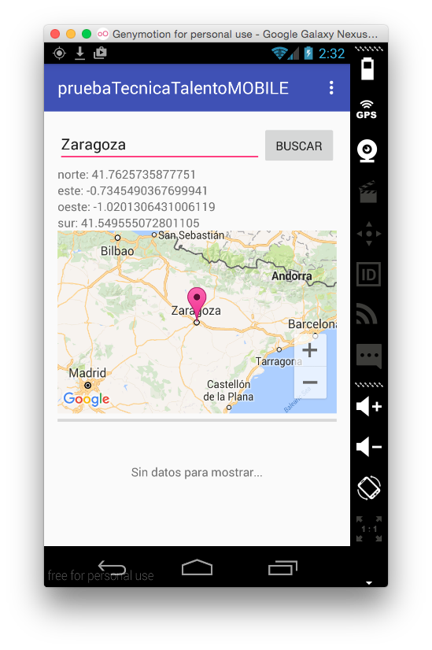

# Prueba técnica (Android) para TalentoMOBILE #

Proyecto utilizado para una prueba de conocimientos para la empresa **talentoMOBILE** sobre la tecnología Android. 

A finales del año 2015 la empresa [talentoMOBILE](http://www.talentomobile.com/) contactó conmigo para una entrevista de trabajo para un puesto como desarrollador Android. Finalmente no entré a formar parte de esta empresa, pero la experiencia - *como siempre* - mereció la pena. 
El proyecto está desarrollado en `Android Studio`, y es una simple aplicación donde escribes el nombre de una ciudad, te calcula las coordenadas de dicha ciudad, te la coloca sobre el mapa de `Google Maps` y te indica la temperatura media de la ciudad que hemos buscado. Todo mediante un par de llamadas a Web Services y parseos de algunos archivos JSON. Fácil y sencillo.

Para más información, visita mi blog: [oskarko.github.io](http://oskarko.github.io/)
